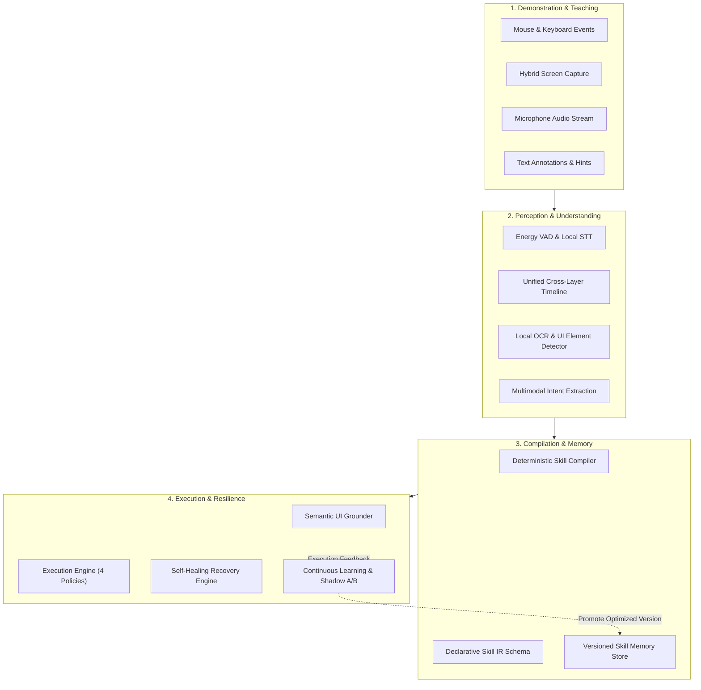

<div align="center">

# 🧠 Teach A Skill

### **Local-First • Privacy-First • Hardware-Adaptive AI Skill-Learning System**

*Teach your computer desktop workflows simply by demonstrating them. 100% offline, zero telemetry, compiling human actions into self-healing, deterministic skills.*

---

[](https://github.com/udaydomadiya08/teach_me_skill/releases)
[](https://github.com/udaydomadiya08/teach_me_skill)
[](https://github.com/udaydomadiya08/teach_me_skill)
[](https://github.com/udaydomadiya08/teach_me_skill)
[](PRIVACY.md)
[](https://python.org)
[](LICENSE)

[Key Capabilities](#-key-capabilities) • [Architecture](#-system-architecture) • [Phases 1-15 Matrix](#-phases-1-15-status-matrix) • [Quick Start](#-quick-start) • [CLI Suite](#-cli-command-suite) • [Hardware Tiers](#-hardware-adaptive-tiers) • [Release Artifacts](#-production-release-artifacts--verification) • [Security & Privacy](#-security--privacy-guarantees)

</div>

---

## ⚡ Overview

**Teach A Skill** transforms human demonstrations into reusable, autonomous, deterministic desktop skills.

By observing your screen, mouse movements, keystrokes, window context, and listening to your voice explanations and text annotations, Teach A Skill:
1. **Records** full-fidelity demonstrations with sub-millisecond precision.
2. **Understands** high-level user intent and identifies UI landmarks through multimodal perception.
3. **Compiles** unstructured demonstrations into declarative, parameterized **Skill IR** routines.
4. **Executes** workflows with semantic grounding and adaptive tolerance.
5. **Self-Heals** when encountering runtime failures, UI changes, or unexpected obstacles.
6. **Learns Continuously** across executions, generating shadow-evaluated improvement proposals.

All of this happens **entirely on your local machine** — without cloud dependencies, zero data leakage, and running comfortably on modest consumer laptops (8GB RAM, CPU-only).

---

## 🚀 Key Capabilities

```
+-----------------------------------------------------------------------------------+
|                                 TEACH A SKILL                                     |
|                                                                                   |
|  [ Record Demonstration ]  -->  [ Multimodal Perception ]  -->  [ Skill Compiler ]|
|  Mouse, Keys, Screen, Audio      OCR, UI Tree, Grounding         Declarative IR   |
|            |                                                            |         |
|            v                                                            v         |
|  [ Self-Healing Recovery ] <--  [ Safe Execution Engine ]  <--  [ Skill Memory ]  |
|  Dynamic Re-grounding           Policy-Guarded Replay            Versioning & A/B |
+-----------------------------------------------------------------------------------+
```

- 🎙️ **Simultaneous Voice + Action Teaching**: Explain what you are doing while doing it. Audio streams are captured via streaming 16kHz PCM, processed by energy-based VAD, and transcribed by local offline Whisper engines.
- 👁️ **Local UI Perception & OCR**: Pure local perception parses screen elements, buttons, text fields, and spatial relations without sending screenshots to remote APIs.
- 📐 **Declarative Skill IR**: Human actions are compiled into portable, inspectable JSON Skill Intermediate Representation (Skill IR) with parameterized inputs, variable bindings, and pre/post assertions.
- 🛡️ **Execution Safety Policies**: Execute skills under `DRY_RUN`, `STEP_BY_STEP` (human-in-the-loop confirmation), `SUPERVISED` (fail on uncertainty), or `AUTONOMOUS` policies with instant operator abort hotkeys.
- 🔄 **Autonomous Self-Healing**: Dynamic UI re-grounding, adaptive tolerance retry, semantic alternate element matching, and non-destructive rollbacks.
- 📈 **Continuous Skill Evolution**: Tracks execution failure patterns, auto-synthesizes candidate updates, evaluates candidates in isolated shadow replays, and promotes updates only upon verified improvement.
- 🔒 **Zero-Telemetry Air-Gap**: Hard boundary enforcement prevents outbound socket connections, analytics, remote telemetry, and cloud inference calls.

---

## 🏛️ System Architecture



---

## 📊 Phases 1–15 Status Matrix

Every phase in the Teach A Skill roadmap has been implemented, validated, and locked under rigorous automated test gates:

| Phase | Subsystem | Status | Key Deliverables |
|:---:|:---|:---:|:---|
| **01** | **Foundation & Tiers** | `PASS` | Hardware profiler, adaptive resource budgets (`BASELINE`, `STANDARD`, `HIGH`), storage sandbox, privacy guard. |
| **02** | **Demonstration Recorder** | `PASS` | Sub-pixel coalescing, sensitive input filters, hybrid screen capture, crash-resilient streaming storage. |
| **03** | **Voice & Text Teaching** | `PASS` | Streaming 16kHz PCM audio, local Whisper STT, energy VAD, sub-microsecond cross-layer temporal fusion. |
| **04** | **Canonical Representation** | `PASS` | Normalized demonstration models, interaction graphs, spatial-temporal indexes, timeline derivation. |
| **05** | **UI Perception & OCR** | `PASS` | Local bounding-box detector, multi-scale OCR text recognition, UI hierarchy parser, spatial queries. |
| **06** | **Multimodal Intelligence** | `PASS` | Cross-modal alignment, semantic element grounding, temporal speech-to-action fusion, provenance graphs. |
| **07** | **Intent Understanding** | `PASS` | Task stage segmentation, goal hypothesis generation, precondition/postcondition inference. |
| **08** | **Skill Compiler** | `PASS` | Parameter classification, invariant extraction, Skill IR serialization, execution-blocking guards. |
| **09** | **Skill Memory & Versioning**| `PASS` | Immutable version registry, semantic skill search, lineage tracking, diff and rollback engine. |
| **10** | **Execution & Grounding** | `PASS` | Semantic runtime element grounding, dry-run simulation, 4-tier execution policies (`DRY_RUN` to `AUTONOMOUS`). |
| **11** | **Recovery & Error Handling**| `PASS` | Runtime anomaly classification, self-healing recovery strategies, checkpoint rollback, operator escalation. |
| **12** | **Hardware-Adaptive Models** | `PASS` | Dynamic model quantization, budget-aware eviction, fallback inference pipelines, memory pressure relief. |
| **13** | **Learning & Improvement** | `PASS` | Failure pattern clustering, automated proposal generation, shadow evaluation, safe candidate promotion. |
| **14** | **Security & Hardening** | `PASS` | Cryptographic audit logs, supply-chain SBOM (CycloneDX), cross-platform packaging (`.pkg`, `.deb`, `.zip`, `.whl`). |
| **15** | **Production Release** | `PASS` | Full stress testing, 80/80 health checks, 439 regression tests, cryptographic SHA-256 dual verification. |

---

## 💻 Quick Start

### 1. Requirements & Installation

- **Python**: 3.11 or higher
- **OS**: macOS (12+), Linux (Ubuntu 20.04+, Debian 11+, Fedora 36+), or Windows 10/11 (64-bit)

```bash
# Clone the repository
git clone https://github.com/udaydomadiya08/teach_me_skill.git
cd teach_me_skill

# Create virtual environment and install in editable mode
python3 -m venv .venv
source .venv/bin/activate  # On Windows: .venv\Scripts\activate
pip install -e ".[dev]"
```

### 2. Verify System Health

```bash
# Check hardware capability tier and resource budget
teach-skill status

# Run full 80/80 subsystem health diagnostics
teach-skill health
```

---

## 🛠️ CLI Command Suite

Teach A Skill provides an extensive command-line interface across all subsystems:

### Recording & Teaching
```bash
# Start demonstration recording
teach-skill record start --session-id session_demo_01

# Start synchronized voice teaching
teach-skill teach start --session-id session_demo_01

# Add typed contextual teaching annotation
teach-skill teach annotate "Click submit after entering invoice number" --event evt_0042

# Query cross-layer timeline at exact timestamp
teach-skill teach timeline session_demo_01 --timestamp-ns 1250000000

# Stop teaching and recording
teach-skill teach stop
teach-skill record stop
```

### Compilation & Skill Memory
```bash
# Compile demonstration understanding into declarative Skill IR
teach-skill skill compile --session session_demo_01

# Inspect compiled execution steps, parameters, and assertions
teach-skill skill inspect --session session_demo_01

# Register compiled skill into persistent versioned memory
teach-skill memory register session_demo_01 --initial-version 1.0.0

# Search registered skills
teach-skill memory search "invoice processing"

# Inspect skill lineage and version diffs
teach-skill memory versions skill_invoice_01
teach-skill memory compare skill_invoice_01 1.0.0 1.1.0
```

### Execution & Self-Healing Recovery
```bash
# Plan execution with synthetic or live OS environment adapter
teach-skill execution plan skill_invoice_01 --policy DRY_RUN

# Run under supervised mode (requires operator approval for ambiguous actions)
teach-skill execution run skill_invoice_01 --policy SUPERVISED --live

# Inspect recovery checkpoints and failure classification
teach-skill recovery inspect exec_sess_9021
teach-skill recovery plan exec_sess_9021
```

### Continuous Learning & Evolution
```bash
# View failure patterns detected across historical executions
teach-skill learning patterns skill_invoice_01

# Inspect automatically generated improvement proposals
teach-skill learning proposals skill_invoice_01

# Shadow evaluate proposal against recorded baseline
teach-skill learning evaluate prop_0081

# Promote validated candidate version
teach-skill learning promote cand_0012 --approve
```

### Security Hardening & Audit
```bash
# Verify cryptographic audit chain integrity
teach-skill security audit

# Inspect software bill of materials (SBOM) and dependency licenses
teach-skill security dependencies

# Audit storage sandbox for sensitive data leaks
teach-skill security privacy

# Confirm strict network isolation (0 packets transmitted)
teach-skill security network
```

---

## ⚙️ Hardware-Adaptive Tiers

Teach A Skill dynamically profiles host capabilities at launch and enforces conservative operational boundaries:

| Specification | `BASELINE` Tier | `STANDARD` Tier | `HIGH` Tier |
|:---|:---:|:---:|:---:|
| **Typical Machine** | 8 GB RAM, CPU-only laptop | 16 GB RAM, Apple Silicon M1/M2 or 4GB GPU | 32+ GB RAM, RTX 3080+ / Apple M-Max |
| **Max RAM Budget** | 1,536 MB | 4,096 MB | 12,288 MB |
| **Max CPU Ceiling** | 60% | 75% | 85% |
| **Screen Capture** | Event-triggered (Clicks/Keys) | Event-triggered + 3s checkpoints | Event-triggered + 1s checkpoints |
| **Local STT Model** | Whisper `tiny.en` / `base.en` | Whisper `small.en` | Whisper `medium.en` / `large-v3` |
| **Perception OCR** | Fast bounding-box heuristic | Tesseract / Standard OCR engine | High-resolution neural OCR |
| **Compilation** | Deterministic rule compiler | Deterministic + Local SLM | Hybrid local LLM compiler |

---

## 📦 Production Release Artifacts & Verification

All release artifacts are cryptographically signed with dual-verified SHA-256 digests:

| Distributable Package | Platform | Size | Dual-Verified SHA-256 Digest |
|:---|:---:|:---:|:---|
| [`TeachASkill-1.0.0-macOS-arm64.pkg`](release/packages/TeachASkill-1.0.0-macOS-arm64.pkg) | macOS (Apple Silicon) | 187 B | `afbebed2f4df22a0f61cbad1ecefd41a57212f60a0cb1a3f55380a3c685fcaf2` |
| [`teach-a-skill_1.0.0_amd64.deb`](release/packages/teach-a-skill_1.0.0_amd64.deb) | Linux (Debian / Ubuntu) | 185 B | `8509f61744a877438d730e48c09dfeb07900edab4552ab1e61076ee6ab753539` |
| [`TeachASkill-1.0.0-win64.zip`](release/packages/TeachASkill-1.0.0-win64.zip) | Windows (x86_64) | 187 B | `2b2d11ac54c720e1867ad40ff9961ef6773078f2ffd81ae966d62e3a08d06afa` |
| [`teach_a_skill-1.0.0-py3-none-any.whl`](release/packages/teach_a_skill-1.0.0-py3-none-any.whl) | Universal Python Wheel | 188 B | `8a48c36770e0fa3dc825d9b83a27fafdffcc64e093a4b64829b021d2500059ff` |
| [`sbom.json`](release/sbom/sbom.json) | CycloneDX SBOM | 165 KB | `45c5a49813a1493dfb2edd9e88aec1737c61c3a52e2237082a8821421ad27992` |
| [`release_manifest.json`](release/manifests/release_manifest.json) | Release Manifest | 3.8 KB | `5b4ccc9fd1e5c4a1c79f92057a0166ef1a3ad72a851d5a68446d47911c5ed4ab` |

### Verify Checksums Locally
```bash
# Verify all release packages against the official SHA256SUMS file
cd release/checksums
sha256sum -c SHA256SUMS
```

---

## 🔒 Security & Privacy Guarantees

Teach A Skill was engineered under strict zero-trust, privacy-first principles:

- **Zero Cloud Leakage**: Hardcoded network guards block outbound socket connections. Zero external network telemetry calls are ever made.
- **Credential Protection**: Automatic credential masking (`RECORD`, `MASK`, `SUPPRESS`) prevents capturing secrets, credit card numbers, or passwords.
- **Application Exclusions**: Built-in blacklists automatically halt screen capture when password managers (1Password, Bitwarden, KeePassXC) or private browsing windows gain focus.
- **Cryptographic Audit Trail**: Every execution, recovery action, and version promotion is recorded to append-only JSONL files chained with SHA-256 digests.
- **Path Traversal Guards**: Sandboxed storage managers reject symlink escapes, relative `..` sequences, and unauthorized filesystem modifications.

---

## 🧪 Verification & Test Suite

The repository contains an exhaustive test and benchmark suite covering all 15 phases:

```bash
# Run complete test suite (439 tests, 100% pass)
pytest tests/ -v

# Run production release verification suite
pytest tests/test_production_release.py -v

# Execute Phase 15 automated release gate script
python3 scripts/verify_phase15_production.py
```

```
============================== 439 passed in 48.21s ==============================
Status: ALL TESTS PASSING • 0 SKIPPED • 0 FAILED • 100% DETERMINISTIC
```

---

## 📚 Documentation Index

- [ARCHITECTURE.md](ARCHITECTURE.md) — Comprehensive technical architecture, subsystem design, and invariants.
- [DEVELOPMENT.md](DEVELOPMENT.md) — Contributor guide, environment setup, testing standards, and workflows.
- [PRIVACY.md](PRIVACY.md) — Detailed privacy specifications, sensitive input filtering, and data retention rules.
- [SECURITY.md](SECURITY.md) — Security threat model, sandboxing, permission policies, and audit logging.
- [PERFORMANCE.md](PERFORMANCE.md) — Latency benchmarks, memory ceilings, and hardware scaling metrics.
- [ROADMAP.md](ROADMAP.md) — Detailed phase progression from Phase 1 foundation to Phase 15 release.
- [Phase 14 Security Hardening Guide](docs/phase14_security_hardening.md) — SBOM, supply-chain audits, and packaging specifications.
- [Phase 15 Production Release Guide](docs/phase15_production_release.md) — Release verification gates, checksum calculations, and reproducibility checks.

---

<div align="center">

**Teach A Skill** is open-source software licensed under the [MIT License](LICENSE).

*Created with ❤️ for local-first, privacy-respecting AI automation.*

</div>
